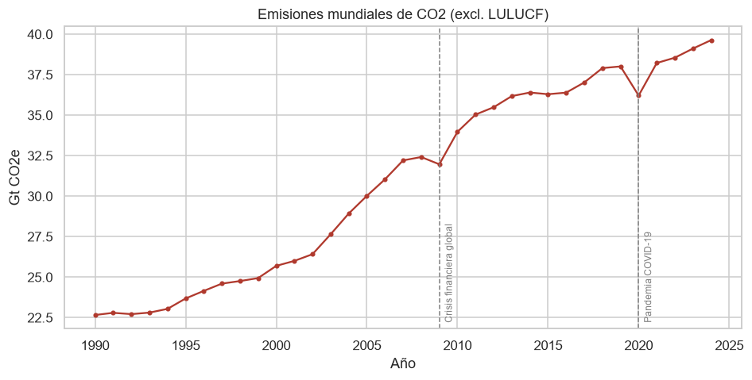
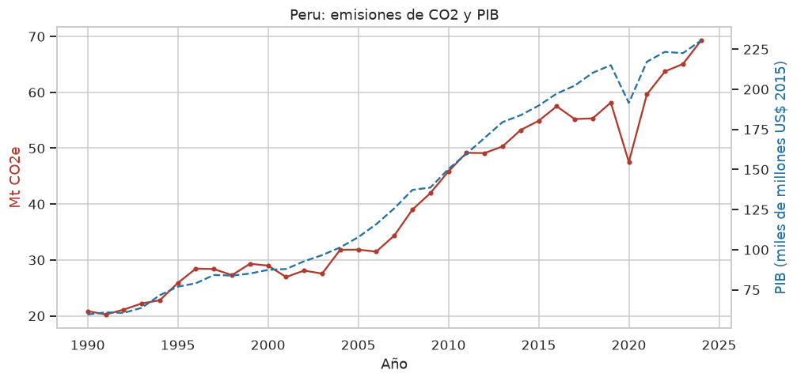

# Grupo 6 · Forecasting de emisiones de CO2

**Área:** Medio Ambiente  
**Curso:** Práctica 1, Entregable 3: Guía de código en Python  
**Universidad Nacional de Ingeniería, FIIS · Ciclo 2026-II**  
**Profesor:** Ing. Hilario Aradiel Castañeda  
**Metodología:** CRISP-ML(Q) ([Studer et al., 2021](https://doi.org/10.48550/arXiv.2003.05155))


## 1. Descripción del proyecto

Los países firmantes del Acuerdo de París deben cumplir sus Contribuciones Determinadas a
Nivel Nacional (NDC). Para evaluar si van por buen camino, los tomadores de decisiones
necesitan **anticipar la trayectoria de las emisiones de CO2**. Las cifras oficiales, en
cambio, se publican con 1 o 2 años de rezago.

Este proyecto construye, con datos abiertos del **Banco Mundial**, un **dataset panel
país-año (1990-2024)** limpio y validado. Está listo para que la siguiente fase (Modeling)
entrene modelos que pronostiquen las emisiones totales de CO2 de cada país.

| Elemento | Detalle |
|---|---|
| Fuente de datos | [World Bank Open Data](https://data.worldbank.org), API v2. Serie de CO2 basada en EDGAR (JRC). Licencia CC BY 4.0 |
| Variable objetivo | `co2_mt`: emisiones de CO2 totales, excluido LULUCF (Mt CO2e) |
| Variables explicativas | PIB, PIB per cápita, población, urbanización, energía renovable, acceso a electricidad, industria (% PIB), electricidad a carbón |
| Unidad de análisis | País y año |
| País de referencia | Perú (`PER`), configurable con `--pais` |
| Resultado | `data/processed/co2_dataset_preparado.csv`: **5 888 filas × 58 columnas, 184 países, 1993-2024** |

### Estructura del repositorio

```
.
├── main.py                        # Código principal (fases 1, 2 y 3)
├── main.ipynb                     # Mismo código en formato Jupyter Notebook
├── README.md                      # este documento
├── requirements.txt               # librerías necesarias
├── data/
│   ├── raw/                       # datos crudos descargados de la API (caché)
│   │   ├── wb_indicadores_raw.csv
│   │   ├── wb_paises_metadata.csv
│   │   └── fuente.json            # fecha de descarga, indicadores y licencia
│   └── processed/
│       ├── co2_dataset_preparado.csv   # dataset final listo para modelar
│       └── diccionario_datos.csv       # descripción de cada columna
└── reports/
    ├── 01_business_understanding.md / .json
    ├── 02_data_understanding.md
    ├── 02_calidad_datos.csv
    ├── 02_estadisticas_descriptivas.csv
    ├── 03_data_preparation.md
    ├── 03_outliers_detectados.csv
    └── figures/                  
```

Todos los archivos de `data/` y `reports/` **los genera `main.py`** (o `main.ipynb`, que produce exactamente las mismas salidas). Se incluyen en el
repositorio para poder revisar los resultados sin ejecutar el código.

---

## 2. Fases trabajadas (CRISP-ML(Q))

### Fase 1: Business Understanding (Comprensión del negocio)

Función `fase1_business_understanding()` → `reports/01_business_understanding.md`

| Aspecto | Definición |
|---|---|
| **Objetivo de negocio** | Contar con estimaciones anticipadas (horizonte de 1 a 5 años) de las emisiones de CO2 por país, para evaluar la brecha frente a las metas NDC y priorizar políticas de mitigación. |
| **Objetivo de minería de datos** | Construir un dataset panel país-año limpio, sin faltantes, con variables rezagadas y sin fuga de información, apto para entrenar modelos que pronostiquen `co2_mt`. |
| **Criterio de éxito de negocio** | Identificar con al menos 1 año de anticipación a los países que se alejan de su trayectoria de reducción. |
| **Criterio de éxito de ML** | MAPE < 10 % en el periodo de prueba 2021-2024 (se evalúa en la fase de modelado, fuera de este alcance). |
| **Criterio económico** | Solo datos abiertos y software libre (costo de licencias = 0). |
| **Interesados** | Ministerios de Ambiente y Energía (p. ej., MINAM y MINEM), banca de desarrollo, investigadores y ONG. |
| **Riesgos** | Indicadores discontinuados, choques (2009, COVID-19), agregados regionales mezclados con países, escalas muy distintas, fuga de información. |

Además, esta fase fija los **requisitos de calidad (QA gates)** que el código verifica de
forma automática en las fases 2 y 3: periodo 1990-2024, al menos 150 países, cobertura del
objetivo ≥ 90 % por país, máximo 30 % de faltantes por variable, 0 nulos y 0 duplicados en
el dataset final, rangos válidos, años consecutivos y ausencia de fuga de información.

### Fase 2: Data Understanding (Comprensión de los datos)

Función `fase2_data_understanding()` → `reports/02_data_understanding.md`

1. **Recolección inicial** (`recolectar_datos`): se descargan 12 indicadores y los
   metadatos de países (región y nivel de ingreso) desde la API del Banco Mundial. En total
   son 111 300 registros crudos. Se guardan en `data/raw/` como caché para asegurar la
   reproducibilidad.
2. **Construcción del panel** (`construir_panel`): los datos pasan de formato largo a una
   tabla país-año y se **excluyen los agregados regionales** (World, Latin America…) para
   evitar el doble conteo. Resultado: 7 595 filas y 217 países.
3. **Exploración** (`explorar_datos`): estadísticas descriptivas, tendencia mundial
   (fig01), top 10 emisores (fig02), distribución del objetivo (fig03), correlaciones de
   Spearman (fig04), PIB frente a CO2 (fig05) y la serie del Perú (fig06).
   - La distribución del CO2 es muy asimétrica (China emite 13 125 Mt, la mediana es
     8.4 Mt), lo que justifica la **transformación logarítmica**.
   - El PIB es la variable más asociada al CO2 (ρ = 0.94), seguido de la población (0.77)
     y de la electricidad generada con carbón (0.60). Las renovables tienen correlación
     negativa (−0.20).
   - Se observan las caídas de 2009 (crisis financiera) y 2020 (COVID-19). En el Perú,
     las emisiones cayeron cerca de 18 % en 2020.
4. **Evaluación de la calidad** (`evaluar_calidad`), en cinco dimensiones:

| Dimensión | Hallazgo |
|---|---|
| Completitud | `energia_pc` (31.6 %) y `fosil_pct` (34.5 %) superan el umbral de faltantes: el Banco Mundial dejó de actualizarlos. `renovable_pct` no tiene datos para 2023-2024 (fig07). |
| Validez | Nauru y Tuvalu reportan CO2 = 0 en todos los años. Seis territorios (Guam, Islas Marshall, Micronesia, etc.) tienen < 0.01 t CO2/hab, unas 20 veces menos que el país más pobre medido: no se miden por separado. `fosil_pct` tiene 6 valores fuera de [0, 100]. |
| Unicidad | 0 duplicados país-año-indicador. |
| Consistencia | CO2 total = CO2 per cápita × población en el 100 % de los casos (tolerancia de 5 %). |
| Exactitud | 228 saltos anuales anómalos en el CO2 (z-score robusto > 3.5 y variación ≥ 15 %). |

5. **Factibilidad** (`verificar_factibilidad`): 195 países cumplen la cobertura mínima
   (el requisito es ≥ 150), así que el proyecto es viable con los datos disponibles.

### Fase 3: Data Preparation (Preparación de los datos)

Función `fase3_data_preparation()` → `reports/03_data_preparation.md`

| Paso | Función | Qué se hace |
|---|---|---|
| 3.1 Selección | `seleccionar_datos` | Se descartan `energia_pc` y `fosil_pct` (> 30 % de faltantes) y `co2_pc` (se deriva del objetivo, habría **fuga de información**). Se conservan los 195 países con CO2 válido en ≥ 90 % de los años. |
| 3.2 Limpieza | `limpiar_datos` | Se eliminan duplicados, los valores fuera de rango pasan a faltantes y el PIB se reconstruye con la identidad PIB = PIB pc × población. Se imputa por país: interpolación lineal (en logaritmos para niveles) en huecos de hasta 5 años, relleno de extremos de hasta 3 años y, al final, la mediana regional del año. **El objetivo nunca se extrapola.** Se eliminan 11 países con faltantes irrecuperables (p. ej., AFG, PRK, YEM, sin PIB reciente). Cada imputación queda marcada en `imputado_<variable>` (1 = imputado). |
| 3.3 Outliers | `tratar_outliers` | Z-score robusto (mediana/MAD) de la variación anual por país y variable. Se detectaron 986 saltos: **79 picos aislados** (suben y vuelven a bajar) se suavizan, **96 choques conocidos** (2009 y 2020) se conservan y se marcan con `choque_2009` y `choque_2020`, y **811 cambios estructurales** se conservan. Los grandes emisores (China, EE. UU.) no se eliminan: son valores reales. |
| 3.4 Transformación | `transformar_datos` | Logaritmos de CO2, PIB y población. Crecimiento anual del PIB y la población. **Rezagos** del objetivo (`log_co2_rezago1` a `log_co2_rezago3`), su variación y media móvil rezagadas. Intensidad de carbono (t-1). Rezagos t-1 de las covariables (sufijo `_rezago1`). `tendencia` e indicadoras `choque_2009` y `choque_2020`. Toda variable derivada del CO2 usa solo años anteriores. |
| 3.5 Integración | `integrar_datos` | Unión con la tabla de metadatos (región y nivel de ingreso, traducidos al español) y variables indicadoras 1/0: 7 de región (`reg_america_latina_caribe`, `reg_europa_asia_central`, …) y 4 de ingreso (`ing_alto`, `ing_medio_alto`, `ing_medio_bajo`, `ing_bajo`). |
| 3.6 Partición | `particionar_temporalmente` | Se etiqueta una partición **temporal** para la fase siguiente (sin entrenar nada): entrenamiento ≤ 2016 (4 416 filas), validación 2017-2020 (736) y prueba 2021-2024 (736). |
| 3.7 Validación QA | `validar_dataset_final` | Se verifican 9 controles: 0 nulos, 0 duplicados, ≥ 150 países, porcentajes en [0, 100], objetivo > 0, sin infinitos, años consecutivos, sin fuga de información y particiones no vacías. **Resultado: 9/9 cumplidos.** |

El escalado o estandarización **no** se aplica aquí a propósito: debe ajustarse solo con el
conjunto de entrenamiento durante el modelado, para no filtrar información del futuro.

### Aseguramiento de la calidad (Quality Assurance) en cada fase

| Fase | Riesgo de calidad | Control implementado en `main.py` |
|---|---|---|
| Business Understanding | Objetivos ambiguos o no medibles | Objetivos y criterios de éxito cuantificados; requisitos exportados a JSON y verificados por código |
| Data Understanding | Datos insuficientes o no plausibles | Reporte de calidad en 5 dimensiones y verificación de factibilidad frente a los requisitos |
| Data Preparation | Errores introducidos al limpiar; fuga de información | Banderas de imputación, bitácora de decisiones, registro de outliers y 9 controles automáticos (el programa termina con código 1 si alguno falla) |

---

## 3. Instrucciones de ejecución paso a paso

### Requisitos previos
- **Python 3.10 o superior** ([descargar](https://www.python.org/downloads/))
- **Git** (opcional, para clonar el repositorio)
- Conexión a Internet **solo** si se quieren volver a descargar los datos (el repositorio ya
  incluye la caché en `data/raw/`)

### Paso 1: Clonar el repositorio

```bash
git clone https://github.com/AlessandroCurto/grupo6-forecasting-emisiones-co2.git
```

```bash
cd grupo6-forecasting-emisiones-co2
```

### Paso 2: Crear y activar un entorno virtual

```bash
python -m venv .venv
```

Windows (PowerShell):

```powershell
.venv\Scripts\Activate.ps1
```

Linux / macOS:

```bash
source .venv/bin/activate
```

### Paso 3: Instalar las dependencias

```bash
pip install -r requirements.txt
```

### Paso 4: Ejecutar el script

```bash
python main.py
```

Opciones disponibles:

| Comando | Efecto |
|---|---|
| `python main.py` | Usa los datos en caché (`data/raw/`); si no existen, los descarga |
| `python main.py --actualizar` | Fuerza una nueva descarga desde la API del Banco Mundial |
| `python main.py --pais CHL` | Cambia el país de referencia de la figura 6 (código ISO3) |
| `python main.py --help` | Muestra la ayuda |

### Paso 5: Revisar los resultados

La ejecución dura unos 10 segundos con caché (cerca de 1 minuto si descarga los datos).
En consola se muestra el avance de cada fase y, al final, un resumen como este:

```
Países en el dataset final : 184
Periodo                    : 1993-2024
Dimensiones                : 5,888 filas x 58 columnas
Controles de calidad       : 9/9 cumplidos
```

El programa termina con código de salida 0 si los 9 controles se cumplen y con código 1
si alguno falla; así se comprueba que la ejecución fue correcta.

Luego se pueden revisar:
1. `reports/01_business_understanding.md`: objetivos y criterios de éxito.
2. `reports/02_data_understanding.md`: exploración y reporte de calidad.
3. `reports/03_data_preparation.md`: bitácora de decisiones, outliers, controles QA y diccionario de datos.
4. `reports/figures/`: las 9 figuras.
5. `data/processed/co2_dataset_preparado.csv`: el dataset final.

### Alternativa: ejecutar en Jupyter Notebook

`main.ipynb` contiene el mismo código que `main.py`, organizado en celdas por fase, con una
explicación antes de cada paso. Las tablas y las 9 figuras se ven dentro del notebook.
Después de los pasos 1 a 3:

```bash
jupyter notebook main.ipynb
```

En Jupyter, elegir **Kernel → Restart & Run All**. El notebook debe estar en la misma carpeta
que `main.py` para usar la caché de `data/raw/`. Las opciones `--actualizar` y `--pais` se
cambian en la celda de parámetros (`ACTUALIZAR` y `PAIS_REF`). La última celda muestra el
mismo resumen y avisa con un error si algún control de calidad no se cumple.

---

## 4. Figuras generadas

| Figura | Contenido |
|---|---|
| `fig01_tendencia_global_co2.png` | Emisiones mundiales 1990-2024 con los choques de 2009 y 2020 |
| `fig02_top10_emisores.png` | Los 10 países con más emisiones en 2024 |
| `fig03_distribucion_objetivo.png` | Distribución del CO2 en escala original y logarítmica |
| `fig04_correlaciones.png` | Matriz de correlación de Spearman |
| `fig05_pib_vs_co2.png` | Relación PIB-CO2 por región |
| `fig06_serie_pais_referencia.png` | CO2 y PIB del Perú |
| `fig07_mapa_faltantes.png` | Porcentaje de faltantes por variable y año |
| `fig08_faltantes_antes_despues.png` | Faltantes antes y después de la limpieza |
| `fig09_variacion_anual_co2.png` | Distribución de la variación anual del CO2 |




---

## 5. Limitaciones

- En los últimos años, algunas covariables se completan con el último valor disponible
  (máximo 3 años). Por ejemplo, `renovable_pct` para 2023-2024 y `carbon_elec_pct` para
  2022-2024. Están marcadas en las columnas `imputado_*`.
- Los datos del Banco Mundial se revisan con frecuencia. Con `--actualizar` los resultados
  pueden variar ligeramente.
- Se excluyen 33 de los 217 países por falta de datos válidos (territorios pequeños y
  países sin PIB reciente como Afganistán, Yemen o Corea del Norte).

## 6. Conclusión

Terminado el proceso, el dataset `co2_dataset_preparado.csv` está libre de valores
faltantes, duplicados, valores fuera de rango y picos anómalos que dañan el modelo. Los
choques reales (2009 y 2020) quedan identificados y no hay fuga de información. Queda así
listo para la fase de **Modeling** de CRISP-ML(Q), que está fuera del alcance de este
entregable.

## 7. Referencias

[1] S. Studer, T. B. Bui, C. Drescher, A. Hanuschkin, L. Winkler, S. Peters y K.-R. Müller, "Towards CRISP-ML(Q): A Machine Learning Process Model with Quality Assurance Methodology", *Machine Learning and Knowledge Extraction*, vol. 3, n.º 2, pp. 392-413, 2021, doi: 10.48550/arXiv.2003.05155.  
[2] World Bank, "World Development Indicators", World Bank Open Data. [En línea]. Disponible: https://data.worldbank.org  
[3] European Commission, Joint Research Centre, "EDGAR - Emissions Database for Global Atmospheric Research". [En línea]. Disponible: https://edgar.jrc.ec.europa.eu  
[4] B. Iglewicz y D. C. Hoaglin, *How to Detect and Handle Outliers*. Milwaukee, WI, EE. UU.: ASQC Quality Press, 1993.
